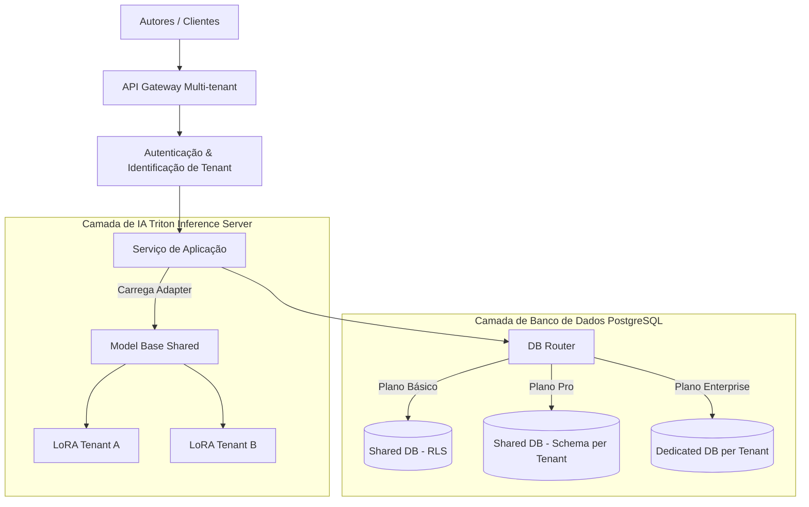

# 5 DESENVOLVIMENTO E ARQUITETURA DO FRAMEWORK CREATIVECLOUD-MT

## 5.1 Especificação Arquitetural

O framework **CreativeCloud-MT** é uma solução completa de software como serviço (SaaS) multi-tenant direcionada a editores literários. Ele é estruturado em quatro camadas principais: Camada de Roteamento de Entrada, Camada de Aplicação, Camada de Inferência de IA Isolada e Camada de Persistência Multidimensional.



## 5.2 Camada de Persistência Multidimensional

O CreativeCloud-MT disponibiliza três níveis de isolamento de banco de dados, mapeados de acordo com os requisitos e custos operacionais de cada segmento de usuários:

### 5.2.1 Nível 1 — Isolamento Lógico baseada em Row-Level Security (Plano Básico)
Recomendado para usuários individuais. Todos os tenants compartilham o mesmo banco de dados e as mesmas tabelas físicas. O isolamento é garantido por meio do PostgreSQL Row-Level Security.

Para implementar essa abordagem com segurança máxima e mitigar riscos de injeção lógica, adota-se o seguinte esquema no PostgreSQL:

```sql
-- Habilita Row-Level Security na tabela de documentos
ALTER TABLE public.documentos ENABLE ROW LEVEL SECURITY;

-- Cria a política de segurança baseada na variável de sessão
CREATE POLICY tenant_isolation_policy ON public.documentos
    FOR ALL
    USING (tenant_id = NULLIF(current_setting('app.current_tenant_id', true), '')::uuid);
```

Toda transação aberta pelo servidor de aplicação inicia-se pela definição da variável de contexto `app.current_tenant_id`. Se a variável não estiver definida, o banco de dados recusa a consulta por omissão, garantindo segurança total.

### 5.2.2 Nível 2 — Isolamento por Esquemas (Plano Profissional)
Recomendado para escritores e grupos editoriais de médio porte. Os tenants compartilham o mesmo servidor e banco de dados físico, porém cada um possui um esquema lógico independente.

```sql
-- Cria esquemas específicos e define permissões restritas
CREATE SCHEMA tenant_ae56f8;
CREATE TABLE tenant_ae56f8.documentos (LIKE public.documentos INCLUDING ALL);
```

O roteador de banco de dados da aplicação (`DB Router`) altera o `search_path` da conexão PostgreSQL dinamicamente após a autenticação do token do usuário:

```sql
SET search_path TO tenant_ae56f8, public;
```

### 5.2.3 Nível 3 — Isolamento Físico de Instâncias (Plano Enterprise)
Recomendado para grandes editoras corporativas. Cada tenant possui uma instância RDS PostgreSQL individual ou é direcionado a um shard físico isolado por meio do Citus. Isso elimina qualquer possibilidade de acesso cruzado de dados nos níveis lógicos e físicos.

## 5.3 Camada de Inferência de IA com Adapters Dinâmicos (LoRA)

Para evitar vazamento de propriedade intelectual por memorização em modelos compartilhados, o CreativeCloud-MT adota o modelo de adaptadores de baixo rank (LoRA) específicos por tenant. A arquitetura de processamento opera conforme detalhado a seguir:

1.  **Modelo Base Congelado:** Utiliza-se o modelo *Llama-3-8B-Instruct* em formato FP16, cujos pesos originais permanecem inalterados e protegidos contra modificações.
2.  **Geração e Treinamento de Adapters LoRA:** Quando um tenant ativa o recurso de personalização e escrita assistida, o sistema cria de forma automática um pequeno conjunto de matrizes LoRA ($r=16, \alpha=32$) acopladas às camadas de projeção de atenção (*q_proj*, *v_proj*). Esse adaptador LoRA é treinado localmente com dados de rascunhos, outlines e notas do próprio tenant.
3.  **Criptografia do Adaptador:** O arquivo de pesos do adaptador (tipicamente contendo cerca de 40 MB de parâmetros adicionais) é salvo criptografado na nuvem (AWS S3) usando uma chave de criptografia AES-256 única por tenant gerenciada via AWS KMS.
4.  **Inferência Dinâmica com Triton Inference Server:** O Triton Inference Server carrega o modelo base na memória da GPU A10G. No momento em que um usuário do *Tenant A* solicita uma recomendação ou auxílio na escrita, o servidor de aplicação envia a requisição juntamente com o identificador do adaptador. O Triton recupera o adaptador LoRA criptografado, decodifica-o em memória RAM e aplica os pesos dinamicamente às saídas do modelo base apenas durante o ciclo de atenção daquela requisição específica.

Essa estratégia impede que os dados gerados por um autor alterem permanentemente os parâmetros do modelo base, eliminando as chances de que outro autor receba sugestões contendo trechos memorizados da obra do primeiro.

## 5.4 Mecanismos de Conformidade LGPD

Para garantir conformidade com os artigos da LGPD, o CreativeCloud-MT implementa um módulo de conformidade automatizado:

*   **Exclusão Física de Dados (Direito de Apagamento):** Em plataformas RLS tradicionais, a deleção lógica (`deleted_at`) é comum. No CreativeCloud-MT, quando um tenant solicita exclusão de conta, executa-se uma deleção física em cascata (`cascade hard-delete`) em todas as tabelas lógicas, limpando permanentemente blocos de dados em disco através da instrução PostgreSQL `VACUUM FULL`.
*   **Apagamento de Artefatos de IA:** Os arquivos de embeddings vetoriais associados ao tenant no SQLite-VSS/PGVector e seu correspondente adaptador LoRA em disco são removidos permanentemente.
*   **Exportação Total de Dados (Portabilidade):** O sistema disponibiliza uma API que gera um arquivo `.zip` contendo os dados brutos e metadados estruturados em JSON, permitindo fácil migração para outros ecossistemas.
*   **Log de Consentimento:** Toda alteração de políticas de privacidade e consentimento de uso de dados para fine-tuning local de LoRA é salva em uma tabela com assinatura hash à prova de adulteração.
