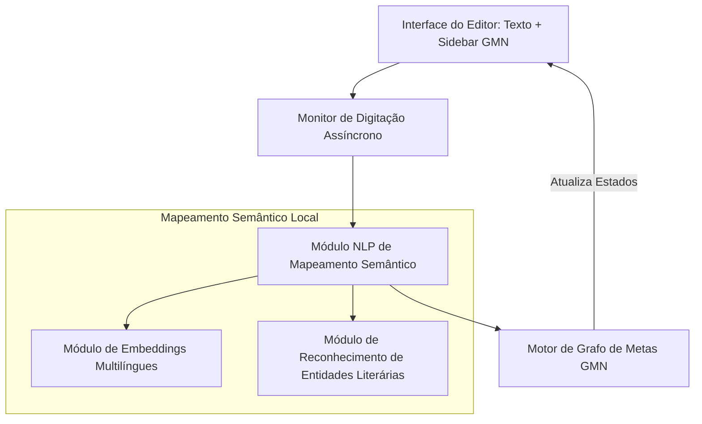

# 5 DESENVOLVIMENTO DO FRAMEWORK TASKWRITER-PT

## 5.1 Arquitetura Geral da Metodologia e do Sistema de Suporte

O framework **TaskWriter-PT** é composto por uma metodologia de desenvolvimento literário orientada por tarefas e por um sistema de software de suporte à escrita integrado em três camadas funcionais:

## 5.2 Estrutura e Engenharia do Grafo de Metas Narrativas (GMN)

O GMN é implementado no sistema por meio de uma base de dados em formato JSON integrada ao IndexedDB local, contendo nós de metas categorizados em três classes:

1.  **Metas de Exposição (Setting Goals):** Focadas no estabelecimento de cenários e regras do universo. Exemplo: "Descrever o clima tenso da cidade portuária de porto-seco no primeiro capítulo".
2.  **Metas de Personagem (Character Goals):** Focadas na revelação de características psicológicas ou mudança de estado emocional do personagem. Exemplo: "Demonstrar a hesitação de Kael ao receber a espada herdada".
3.  **Metas de Conflito (Conflict Goals):** Focadas em eventos-chave de ação ou revelações dramáticas de enredo. Exemplo: "Fazer com que o mentor Valdris alerte Kael sobre a traição iminente antes do clímax".

As arestas conectam as dependências causais. Se a meta de conflito *B* requer que a pista de personagem *A* seja introduzida para evitar um "buraco de roteiro" (*plot hole*), cria-se a aresta direcionada $(A, B)$.

## 5.3 Módulo de Mapeamento Semântico Inteligente (MMS)

O principal diferencial técnico do TaskWriter-PT é a capacidade de atualizar automaticamente o status das metas do GMN com base no processamento do texto que o autor está redigindo, eliminando a necessidade de gerenciamento manual passivo. O pipeline do MMS funciona em segundo plano através dos seguintes passos:

1.  **Extração de Entidades Nomeadas (NER):** O módulo NER literário (Tese 01) identifica os personagens e locais presentes no parágrafo recém-escrito.
2.  **Similaridade Semântica de Embeddings:** O parágrafo é convertido em um vetor de embeddings através de um modelo local de sentenças (*multilingual-e5-small*). O sistema calcula a similaridade de cosseno $S_{cos}$ entre o vetor do parágrafo escrito e a descrição conceitual da meta narrativa pendente.
3.  **Mapeamento de Ação baseada em Regras:** Um analisador baseado em regras sintáticas valida se ações específicas descritas na meta ocorreram. Exemplo: se a meta exige "Kael desembainha a espada", o sistema busca a proximidade sintática do verbo *desembainhar* ou sinônimos (extraídos via WordNet em português) ao substantivo *espada* na mesma oração.

Se o score combinado de similaridade e NER ultrapassar o limiar de aceitação $\tau_i$ definido para a meta $v_i$ (tipicamente $\tau \ge 0,72$), a meta transiciona de *EM\_ANDAMENTO* para *CONCLUIDO* de forma silenciosa, e a interface exibe um indicador sutil de sucesso no nó correspondente na barra lateral do editor.

## 5.4 Detecção de Inconsistências Narrativas e Propagação de Alertas

Quando o escritor desvia substancialmente do plano traçado no GMN — por exemplo, decidindo no texto que o mentor *Valdris* é capturado antes de alertar *Kael* (violando a dependência de precedência da meta posterior) —, o sistema executa o algoritmo de travessia e propagação de estado no grafo:

1.  O sistema detecta que a meta original de conflito "Valdris alerta Kael" foi inviabilizada no trecho gerado.
2.  O estado desse nó de meta é alterado para *INCONSISTENTE*.
3.  O motor do grafo propaga o estado recursivamente para todos os nós descendentes interconectados pelas arestas de dependência causal direta e indireta.
4.  A sidebar destaca os caminhos afetados do grafo em vermelho e exibe uma notificação explicativa não-intrusiva: *"Atenção: A captura precoce de Valdris inviabilizou a meta de aviso sobre a traição no Capítulo 15. Você precisa revisar o plano do enredo ou reescrever a cena atual."*

Isso permite que o escritor tome decisões criativas conscientes sobre se deseja reescrever o texto para se ajustar ao plano ou se prefere alterar o próprio grafo de planejamento narrativo de forma dinâmica para acomodar o novo rumo do enredo, mantendo a consistência causal da história.
