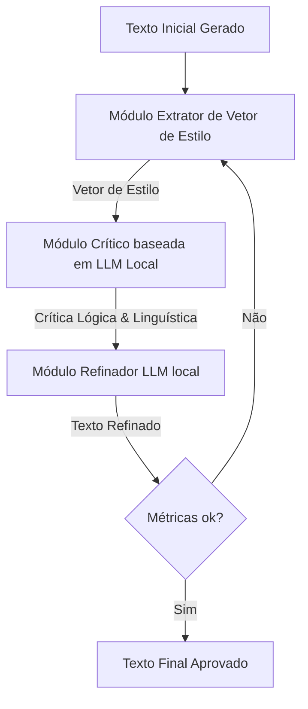

# 5 DESENVOLVIMENTO DO FRAMEWORK STYLEGUARD-PT

## 5.1 Arquitetura Detalhada do Pipeline Híbrido

O framework **StyleGuard-PT** opera de forma modular sobre a interface de coautoria do sistema. O pipeline de controle de qualidade e refinamento estilístico é composto por três módulos executados de maneira encadeada:



## 5.2 Módulo 1 — Extração de Vetor de Estilo (EVE)

O módulo EVE analisa o texto e calcula matematicamente as métricas descritas no Capítulo 4:
*   Mecanismo de tokenização e POS-tagging em português via SpaCy.
*   Cálculo do TTR de Guiraud, contagem de desvio padrão de tamanho de frases e identificação sintática de construções de voz passiva analítica e gerúndios.
*   Geração do vetor estilístico real do trecho $\mathbf{v}_{real}$. O sistema compara esse vetor com um vetor de estilo de referência ideal do autor $\mathbf{v}_{ref}$ (previamente extraído de seus textos autorais originais).

## 5.3 Módulo 2 — Crítico Baseado em LLM Local (CLLM)

Se o desvio $\|\mathbf{v}_{real} - \mathbf{v}_{ref}\| > \theta$ (limiar configurável, default 0,15), o módulo CLLM é ativado. Utiliza-se um modelo de linguagem local quantizado (*Qwen2.5-7B-Instruct*) executando via llama.cpp.

O CLLM recebe o texto gerado, o vetor de desvios estilísticos e a ontologia do universo ficcional (para consistência de fatos). O modelo gera uma crítica estruturada no formato JSON:

```json
{
  "coesao_estilo": {
    "status": "falha",
    "critica": "O tom decaiu em direção à formalidade excessiva no segundo parágrafo, usando palavras como 'destarte'. Mantenha a prosa introspectiva."
  },
  "decalques_ingles": {
    "status": "falha",
    "critica": "Identificou-se o uso de voz passiva excessiva ('foi empurrado por') e três gerúndios consecutivos na mesma sentença."
  },
  "consistencia_factual": {
    "status": "sucesso",
    "critica": "Nenhuma inconsistência factual com a ficha do personagem Kael encontrada."
  }
}
```

## 5.4 Módulo 3 — Refinamento Incremental Estilístico (RIE)

O módulo RIE recebe o texto original, a crítica em formato JSON e as diretrizes de reescrita. O RIE usa o mesmo modelo local ajustado com um prompt estruturado de refinamento (*Self-Refine*):

```
[Contexto de Edição]
Você é um editor literário experiente em língua portuguesa. Reescreva o rascunho de texto abaixo para corrigir os problemas estilísticos e factuais apontados pela revisão crítica.

[Rascunho Original]
{rascunho}

[Crítica do Editor]
{critica_json}

[Instruções de Refinamento]
- Remova palavras arcaicas ou formais incompatíveis com o tom da narrativa.
- Converta voz passiva para voz ativa ativa. Ex: 'O livro foi lido por Kael' -> 'Kael leu o livro'.
- Ajuste o vocabulário para atingir o estilo do autor em português, mantendo a coesão semântica.

[Texto Refinado]
```

O texto resultante passa por uma nova verificação no módulo EVE. O pipeline executa por no máximo 3 iterações para evitar loops infinitos de reescrita e garantir latência adequada.

## 5.5 Integração no Fluxo de Escrita (Flow Preservation)

Para evitar a intrusão visual e a consequente quebra de foco do autor (CreativeFlow, 2024), a execução do StyleGuard-PT ocorre de forma assíncrona. Quando o escritor solicita uma sugestão ou continuação automática de um parágrafo via IA, a interface de edição exibe o texto preliminar de forma translúcida. O pipeline StyleGuard-PT roda em segundo plano na CPU/GPU local. Uma vez concluída a verificação e o refinamento, o texto translúcido é substituído de forma suave pelo texto final refinado de alta qualidade.
